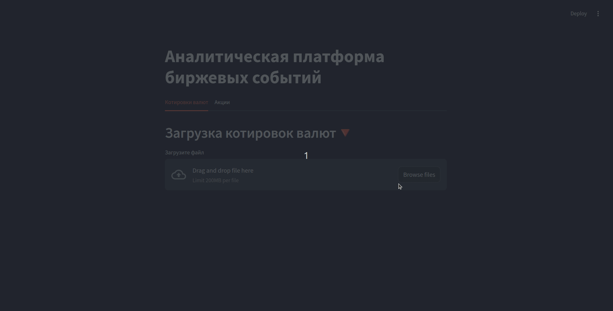

# Аналитическая платформа биржевых событий
Материалы к годовому проекту.

## Описание проекта:
Проект предполагает создние аналитической платформы, которая может выступать в роли инвестиционного советника, агрегируя различные финансовые и социальные данные, влияющие на стоимость ценных бумаг. Вся дополнительная информация (чекпойнты и так далее) находятся в папке ```info/```.

## Запуск
Выполните команду:
> docker-compose up -d  

Перейдите в браузере по ссылке:

> http://localhost:8501

## Инструкция для пользователя

1. Загрузка данных

Прежде чем начать работу, необходимо загрузить файл с данными. Приложение поддерживает два типа данных:

* Котировки валют
* Котировки акций 

Для этого используйте интерфейс для загрузки файлов:

Загрузите табличные данные в формате Parquet, где столбцы должны содержать котировки, а индексом должна быть дата. Пример такого датфрейма можете найти в [описании данных](info/dataset.md).

В верхней части экрана будет кнопка для загрузки файла.
После загрузки данные автоматически очищаются и подготавливаются для дальнейшей работы.

2. Выбор тикера  

После загрузки данных необходимо выбрать тикер, который будет использован для анализа:

В левой боковой панели будет доступен поиск тикера. Введите тикер (например, валютную пару или акцию), и/или выберите его из предложенного списка.

3. Обучение модели
Чтобы обучить модель на загруженных данных:

Перейдите на вкладку Обучение. Для модели AutoArima, CatBoost не нужно указывать никаких дополнительных параметров, но если выбрали Holt-Winters, то укажите следующее:  
* Тип тренда: выберите между "add" и "mul".
* Тип сезонности: выберите между "add" и "mul".
* Сезонный период: укажите длину сезонного цикла.


Введите ID модели и нажмите кнопку *Обучить модель*.
4. Прогнозирование
Для прогнозирования будущих значений на основе обученной модели:

- Перейдите на вкладку Прогнозирование.
- Выберите модель из доступных.  
- Укажите период прогноза (в днях) и нажмите Предсказать!.   
- Приложение построит график, где будет видно как исторические данные, так и предсказания на будущее.


5. Управление моделями  

Вы можете управлять моделями:
- Удалить все модели — удалит все сохраненные модели на сервере.  
- Установить активную модель — позволяет установить одну из моделей как активную для прогнозирования.




## Команда проекта:
Имя Фамилия - @Telegram, GitHub

### Куратор:
- Алина Костромина - @elineii, elineii.

### Участники:
- Артём Боярских — @boyartskikh, 113578;
- Сергей Запашний — @rergogrey, rergogrey;
- Егор Горбунов — @Gera0322, geragora;
- Дмитрий Васильков — @dsvasilkov, dsvasilkov.
